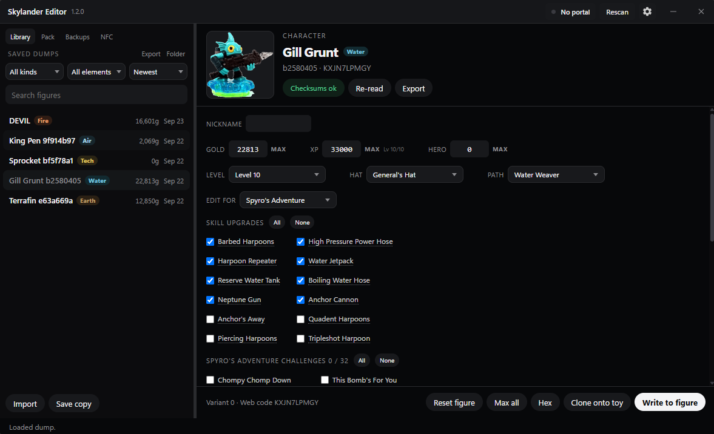

# Skylander Editor

Windows app for editing Skylanders. Works with a Portal of Power or an NFC reader. You can dump figures, back them up, and edit saves.

Download the latest `Skylander Editor X.Y.Z.exe` from this repo (version is in the filename). The latest version number is also in the `version` file. Keep `libusb-1.0.dll` next to the exe.

**Portals**

Wii, PS3, PS4, and Wii U just work. Xbox 360 needs the driver setup in the app. Xbox One and Series portals are not supported; use a different pad.

**Editing**

Gold, XP, hats, skills, nicknames, heroics and quests. Also SWAP Force, traps, vehicles, and Imaginator crystals. Nothing writes until you confirm. Figure ID and tag UID stay the same.

# USE PRECAUTION, IF YOU BRICK YOUR SKYLANDER IT IS NOT THE EDITORS FAULT. Always make sure to save a back up.

**License**

Closed source. Personal use of the Windows builds. Skylanders is Activision's, this isn't affiliated with them.
